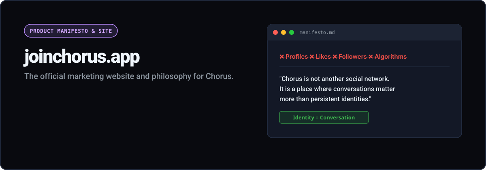

<p align="center">
  
</p>

<p align="center">
  <a href="https://github.com/joinchorus/website/actions/workflows/ci-cd.yml"></a>
  <a href="LICENSE"></a>
  <a href="https://joinchorus.app"></a>
</p>

<h3 align="center">The official marketing website and product manifesto for Chorus.</h3>

---

## 🔗 Ecosystem Links

- 🌐 **Marketing Website:** [joinchorus.app](https://joinchorus.app)
- 📖 **Documentation Portal:** [docs.joinchorus.app](https://docs.joinchorus.app)
- 💬 **Launch Application:** [chat.joinchorus.app](https://chat.joinchorus.app)
- 💻 **Application Repository:** [joinchorus/chorus](https://github.com/joinchorus/chorus)

---

## 💡 Overview

This repository hosts the static marketing website and product manifesto for Chorus. Designed with an editorial, Apple Human Interface Guidelines and Linear-inspired visual style.

### Key Sections:
- **Product Manifesto:** Explaining zero accounts, thread-scoped identities, and chronological reading.
- **Architectural Difference:** Interactive SVG diagrams demonstrating Chorus vs traditional social networks.
- **Native Dark/Light Mode:** Native CSS variable theme switching.
- **SEO & Social Metadata:** Pre-rendered OpenGraph tags and semantic HTML5.

---

## 🛠️ Local Development

```bash
# Clone the repository
git clone https://github.com/joinchorus/website.git
cd website

# Serve locally
npm run serve
# Available on http://localhost:3000
```

---

## 📦 Deployment

Deploys independently to **Firebase Hosting** targeting `joinchorus.app` via GitHub Actions (`.github/workflows/ci-cd.yml`).

---

## 📄 License

Distributed under the MIT License. See [LICENSE](LICENSE) for details.
